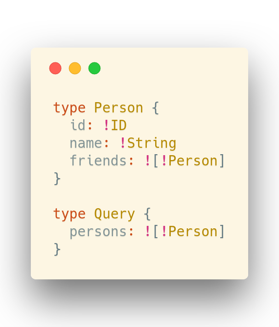
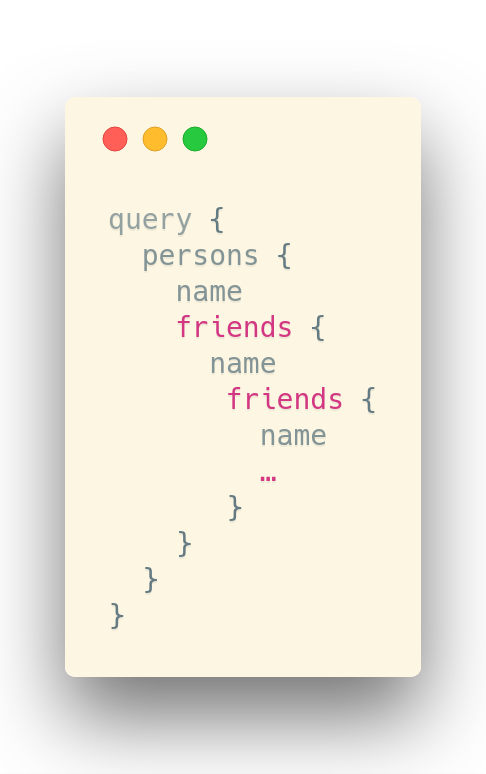

Intro to GraphQL
===


[@sicarius](https://twitter.com/sicarius)

---

Overview
===

* Opening slide, overview and history
* Desired features
* Query by example
* The GraphQL Schema
* Query complexity
* Caching
* Code and interaction and things

---

A short history of GraphQL
===

* Facebook started development on GraphQL in 2012.
* GraphQL was released publicly in [2015](https://code.fb.com/core-data/graphql-a-data-query-language/).
* GraphQL is now developed by a community, see [graphql.org](https://graphql.org/).

---

Desired features: communication
===

* We desire low communication overhead
  * fewer requests
  * smaller requests
* We achieve this by:
  * specializing requests
  * batching several requests together
  * moving query complexity to the server

-v-

Desired features: integrity
===

* We desire correctness of data in transit
  * correctness of handling at server- and client-side
* We achieve this by:
  * Having the server publish a schema that the client can discover
  * validating all data transferred in either direction against a schema

-v-

Desired features: ease of use
===

* We desire the API to be easy to use
  * abillity to discover
  * simple to write queries
* We achieve this by:
  * Using the schema to provide documentation and auto-completion for the API
  * something similar to query by example (IBM Research 197*)

---

Query Playground
===


-v-

Query Playground
===

Let's visit:
https://graphql.org/swapi-graphql/

---

Schema: Scalar types
===

| Type    | Description                                  |
| ------- | -------------------------------------------- |
| Int     | Signed 32-bit integer                        |
| Float   | Signed double-precision floating point value |
| Boolean | true or false                                |
| ID      | Unique identifiers, serialized like a string |

-v-

Schema: Enums
===

```graphql
enum Protocol {
  HTTP
  SMTP
  NTP
}
```

-v-

Schema: Nested structures
===

* Objects and Inputs
* Lists
* Non-Null

```graphql
type Foo {
  count: Int!
  bars: [Bar!]!
}

input Bar {
  name: String!
}
```

-v-

Schema: Definition
===

```graphql
schema {
  query: Query
  mutation: Mutation
  subscription: Subscription
}
```

* Must have: `query`
* May have: `mutation`, `subscription`

---

Query complexity
===

Consider this setup:

| Type                                       | Query                                       |
| ------------------------------------------ | ------------------------------------------- |
|  |  |

---

Caching
===

* What data is best to cache?
* Where can caching be done?
* Use of case specific connections depending on caching case

---

Before the code
===

* Anyone without a Computer but desires to code?
  * Maybe team up?
* If you haven't already clone https://github.com/runjak/nook2018
  * Run `npm install` or `yarn install`
* We will get to this again in a bit ;)